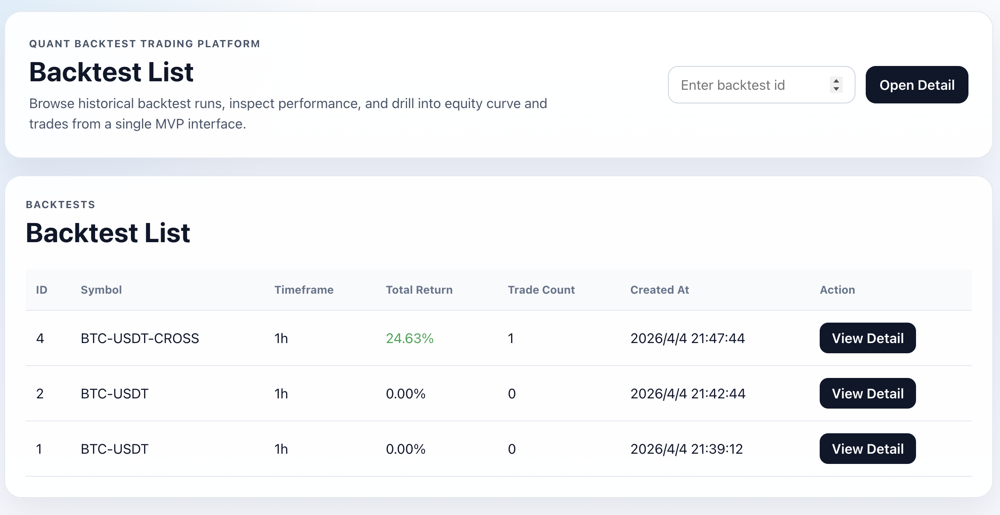
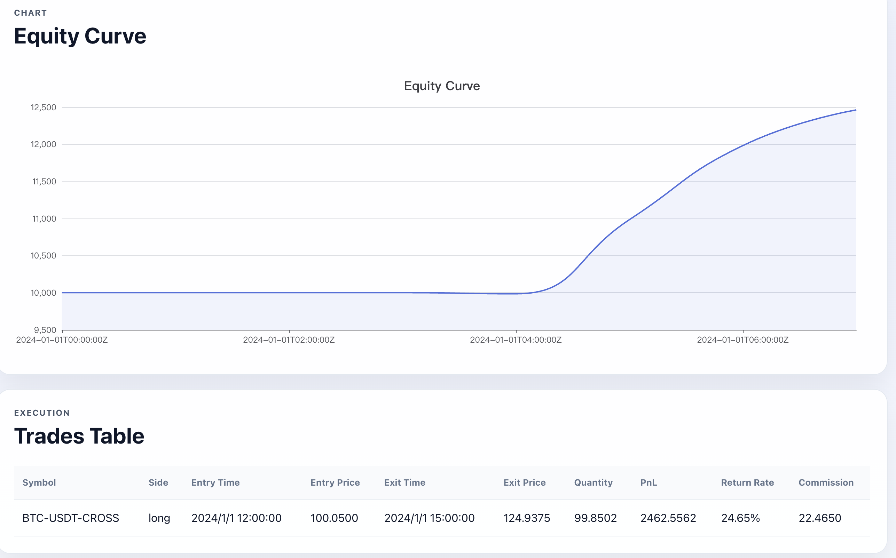
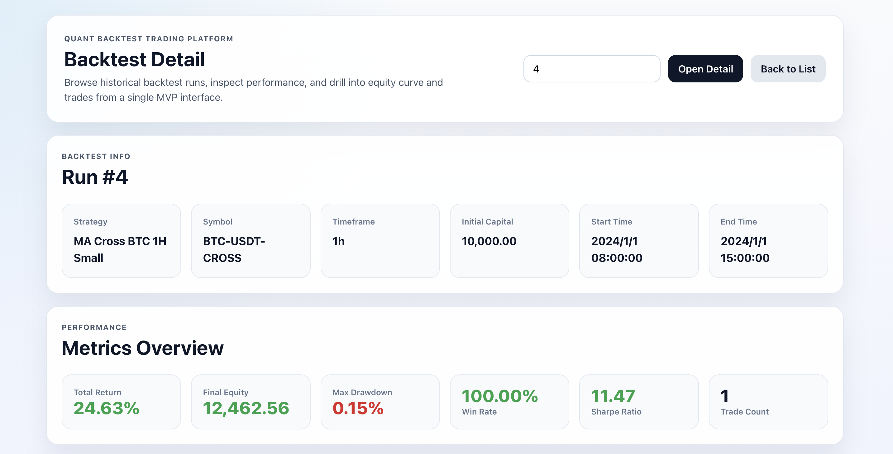

# Project Name

Quant Backtest Trading Platform (MVP)

## Overview

Quant Backtest Trading Platform is a quantitative backtesting MVP focused on a complete product loop from historical market data import to backtest result visualization.

The current project scope is:

- import market data from CSV
- create and query strategies
- execute backtests
- persist backtest results and trades
- query backtest detail and trades
- visualize metrics, equity curve, and trade records in the React frontend

This project is a backtesting platform MVP. It is not a real trading system.

## Preview

### Overview


### Equity Curve


### Trades


## Core Features

- Strategy creation, update, query, and deletion
- Market dataset CSV import and dataset query
- Backtest execution with persisted run records
- Backtest detail query with metrics and equity curve
- Backtest trades query
- React page that loads a backtest result by id
- Metrics overview, equity curve, trades table, and summary display
- Frontend and backend integration already running end to end

## Tech Stack

### Backend

- Go
- Gin
- GORM
- MySQL

### Frontend

- React
- TypeScript
- Vite
- ECharts

## System Architecture

The system uses a frontend-backend separated architecture.

### Backend

The Go backend provides REST APIs for:

- strategy management
- market dataset import and storage
- backtest execution
- backtest result query
- trade record query

It persists strategies, market datasets, backtest runs, and backtest trades in MySQL.

### Frontend

The React frontend is used for result visualization. It loads a backtest by id and renders:

- backtest info
- metrics overview
- equity curve
- trades table
- summary

### End-to-End Flow

`data import -> strategy backtest -> result visualization`

## Project Structure

```text
tradingsystem/
├── cmd/server/                    # backend entrypoint
├── configs/                       # example configuration files
├── data/market_datasets/          # imported CSV files
├── internal/
│   ├── backtest/                  # backtest engine, metrics, strategy logic
│   ├── database/                  # MySQL connection
│   ├── dto/                       # request and response DTOs
│   ├── handler/                   # Gin HTTP handlers
│   ├── model/                     # GORM models
│   ├── repository/                # data access layer
│   ├── router/                    # route registration
│   └── service/                   # business logic
├── migrations/mysql/              # MySQL schema scripts
├── pkg/response/                  # API response helpers
└── web/templates/                 # server-side templates
```

Frontend project:

```text
../tradingsystem-web/
├── src/api/                       # frontend API calls
├── src/components/                # chart and table components
└── src/App.tsx                    # backtest result page
```

## API Endpoints

### Health

- `GET /api/v1/health`

### Strategies

- `POST /api/v1/strategies`
- `GET /api/v1/strategies`
- `GET /api/v1/strategies/:id`
- `PUT /api/v1/strategies/:id`
- `DELETE /api/v1/strategies/:id`

### Market Datasets

- `POST /api/v1/market-datasets/import`
- `GET /api/v1/market-datasets`
- `GET /api/v1/market-datasets/:id`
- `DELETE /api/v1/market-datasets/:id`

### Backtests

- `POST /api/v1/backtests`
- `GET /api/v1/backtests`
- `GET /api/v1/backtests/:id`
- `GET /api/v1/backtests/:id/trades`

### Browser Routes

- `GET /`
- `GET /backtests/view`

## How to Run

### 1. Prepare MySQL

Create a MySQL database for the project, then set these environment variables before starting the backend:

- `MYSQL_HOST`
- `MYSQL_PORT`
- `MYSQL_USER`
- `MYSQL_PASSWORD`
- `MYSQL_DB`

Example:

```bash
export MYSQL_HOST=127.0.0.1
export MYSQL_PORT=3306
export MYSQL_USER=root
export MYSQL_PASSWORD=root
export MYSQL_DB=tradingsystem
```

### 2. Run Backend

From the `tradingsystem` directory:

```bash
go run ./cmd/server
```

The backend listens on `http://localhost:8080`.

### 3. Run Frontend

From the backend project directory:

```bash
cd ../tradingsystem-web
npm install
npm run dev
```

The frontend runs with the Vite dev server and uses the backend APIs for backtest result loading.

## Example Workflow

1. Start MySQL and set the required environment variables.
2. Run the backend with `go run ./cmd/server`.
3. Start the frontend from `../tradingsystem-web`.
4. Create a strategy through the strategies API.
5. Import a market dataset CSV through the market dataset API.
6. Create a backtest run through the backtests API.
7. Open the React page and load the result by backtest id.
8. View metrics, equity curve, trades table, and summary.

## Future Improvements

- Add dedicated frontend pages for strategy management
- Add dedicated frontend pages for market dataset management
- Add backtest history and result comparison views
- Support more strategy implementations in the backtest engine
- Improve reporting and analysis views
- Refine backtest configuration validation and execution visibility

## Notes

- This repository is positioned as a Quant Backtest Trading Platform MVP.
- The implemented flow is `data import -> strategy backtest -> result visualization`.
- The frontend and backend are already integrated and running together.
- The current focus is backtest execution and result presentation, not live execution.
